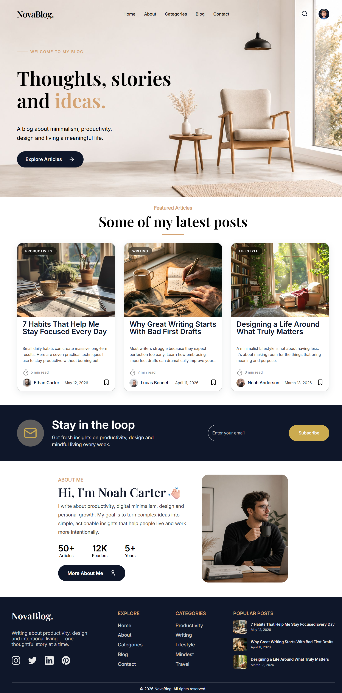

# NovaBlog

A clean, modern and fully responsive blog template designed for content creators, writers and personal brands.

---

## Live Demo

🔗 [https://quantoris01.github.io/novablog-template/](https://quantoris01.github.io/novablog-template/)

---

## Preview

<p align='center'>
    
</p>

---

## Features

- Fully Responsive Design
- Modern Minimalist UI
- Mobile Navigation Menu
- Search Modal
- Articles Grid Layout
- Newsletter Subscription Section
- About Section
- Clean Footer Layout
- Semantic HTML Structure
- Pure CSS Animations
- No Frameworks Required

---

## Built With


---

## Project Structure

```text
novablog-template/
├── index.html
├── styles/
│   └── app.css
├── js/
│   └── app.js
├── images/
└── fonts/
    ├── inter/
    └── playfair-display/
```
---

## Run Locally

Clone the project:

```bash
git clone https://github.com/QUANTORIS01/novablog-template.git
cd novablog-template
```

Open index.html in your preferred browser.

For development, using VS Code Live Server is recommended.

---

## Screenshots

### Desktop

<p align='center'>
    
</p>

### Tablet

<p align='center'>
    
</p>

### Mobile

<p align='center'>
    
</p>

---

## Future Improvements

- Dark Mode
- Blog Post Details Page
- Category Archive Pages
- Author Profile Page
- Functional Search System
- Backend Integration (Django / API)

---

## Author

GitHub: [QUANTORIS01](https://github.com/QUANTORIS01)

## License

This project is licensed under the MIT License.


